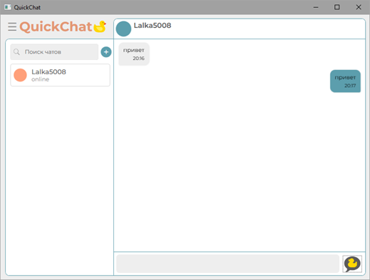
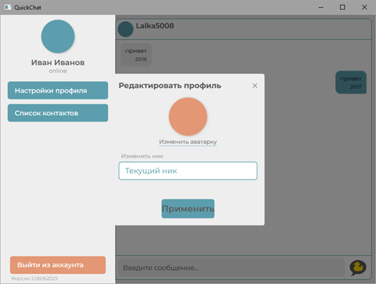

# QuickChat - Документация проекта

## Оглавление
1. [Общее описание](#1-общее-описание)
   - [Проблема](#11-проблема)
   - [Функциональность](#12-функциональность)
   - [Стек технологий](#13-стек-технологий)
2. [Клиентская часть](#2-клиентская-часть)
   - [Навигация](#21-навигация-между-экранами)
   - [Техническая документация](#22-техническая-документация)
3. [Серверная часть](#3-серверная-часть)
   - [Особенности](#31-особенности)
   - [Установка и запуск](#32-установка-и-запуск)
   - [API Endpoints](#33-api-endpoints)

---

## 1. Общее описание

### 1.1 Проблема
В современном онлайн-мире существует потребность в легком, быстром и наглядном мессенджере с базовым функционалом. Большинство решений либо перегружены функциями, либо сложны в поддержке. Студенты и небольшие команды нуждаются в простом, но расширяемом решении для общения.

### 1.2 Функциональность
**Основные возможности:**
- Авторизация и регистрация
- Просмотр чатов и контактов
- Обмен сообщениями в реальном времени
- История сообщений
- Статусы пользователей

### 1.3 Стек технологий
**Клиент:**
- .NET 9 / WPF
- Newtonsoft.Json
- XAML

**Сервер:**
- ASP.NET Core 6.0
- PostgreSQL 15
- Entity Framework Core 7.0
- Swagger/OpenAPI

---

## 2. Клиентская часть

### 2.1 Навигация между экранами
**Основные компоненты:**
- Страница авторизации (`LoginPage`)

- Страница регистрации (`RegisterPage`)

- Главная страница с чатами (`ChatPage`)

- Диалоговые окна:
  - Подтверждение выхода
    
  - Редактирование профиля
    

### 2.2 Техническая документация

#### Класс `ChatPage.cs`
**Ответственность:** Управление чатами и сообщениями

| Компонент | Тип | Описание |
|-----------|-----|----------|
| `_currentUser` | private поле | Текущий пользователь |
| `LoadContactsAsync()` | private метод | Загрузка контактов |
| `ChatPage(UserDTO)` | конструктор | Инициализация страницы |

#### Класс `LoginPage.cs`
**Ответственность:** Авторизация пользователя

| Метод | Видимость | Описание |
|-------|-----------|----------|
| `LoginButton_Click` | public | Обработчик входа |
| `SetPlaceholders()` | private | Установка плейсхолдеров |

#### Класс `AuthApiClient.cs` (Singleton)
**Ответственность:** Работа с API аутентификации

| Метод | Описание |
|-------|----------|
| `RegisterAsync()` | Регистрация |
| `LoginAsync()` | Авторизация |
| `HashPassword()` | Хеширование SHA256 |

---

## 3. Серверная часть

# QuickChatBase - Серверная часть чат-приложения

Серверная часть чат-приложения, разработанная на ASP.NET Core с использованием PostgreSQL в качестве базы данных. Проект предоставляет RESTful API для управления пользователями, чатами и сообщениями.

## 3.1 Особенности

- Регистрация и аутентификация пользователей
- Создание личных и групповых чатов
- Отправка и получение сообщений
- Отметка сообщений как прочитанных
- Хранение истории сообщений
- Статусы онлайн/оффлайн пользователей

## 3.2 Установка и запуск

1. **Клонируйте репозиторий:**
   ```bash
   git clone https://github.com/yourusername/QuickChatBase.git
   cd QuickChatBase/Server
   ```

2. **Настройте базу данных:**
   - Установите PostgreSQL 15+
   - Создайте базу данных с именем `QuickChatBase`
   - Обновите строку подключения в `appsettings.json`:
     ```json
     "ConnectionStrings": {
       "QuickChatBase": "Host=localhost;Port=5432;Database=QuickChatBase;Username=youruser;Password=yourpassword"
     }
     ```

3. **Примените миграции:**
   ```bash
   dotnet ef database update
   ```

4. **Запустите сервер:**
   ```bash
   dotnet run
   ```

5. **Документация API:**
   - После запуска откройте в браузере `https://localhost:5001/swagger`

## 3.3 API Endpoints

### Аутентификация
- `POST /api/auth/register` - Регистрация нового пользователя
- `POST /api/auth/login` - Вход пользователя

### Пользователи
- `GET /api/users` - Получить список пользователей

### Чаты
- `GET /api/chats` - Получить чаты пользователя
- `POST /api/chats` - Создать новый чат

### Сообщения
- `GET /api/messages` - Получить список сообщений
- `GET /api/messages/chat/{chatId}` - Получить сообщения чата
- `POST /api/messages` - Отправить сообщение
- `PUT /api/messages/{id}` - Обновить сообщение
- `DELETE /api/messages/{id}` - Удалить сообщение
